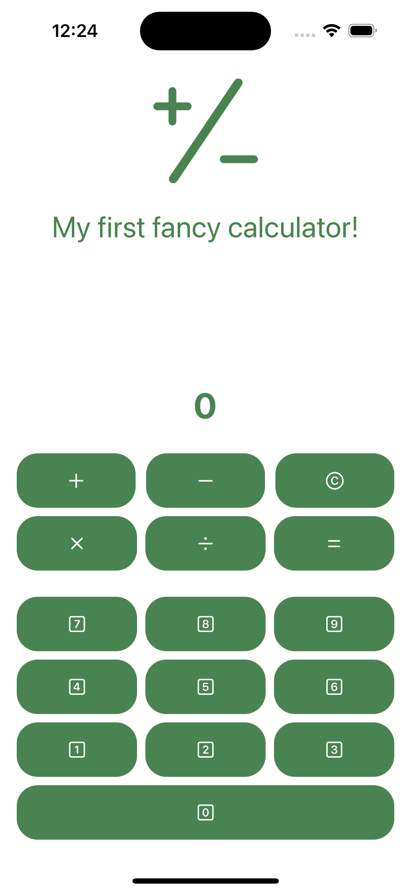
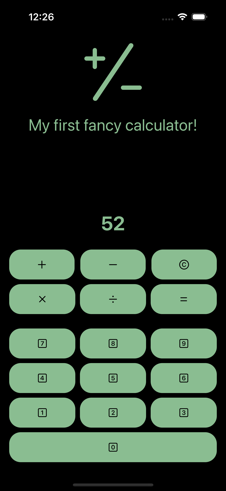

# SimpleCalc 🧮

Basic calculator app for iOS.
This app was made as a homework for iOS App Development course. Main task was to implement logic and also keep the code clean.

## Screenshots

## Features
- Addition
- Subtraction
- Multiplication
- Division

(Awesome and unbelievable, I know right? 🤯)

- Dark mode compatible color scheme

## Technologies used
- Swift with SwiftUI
- MVVM Architecture (as much as its possible for application of this scale)
